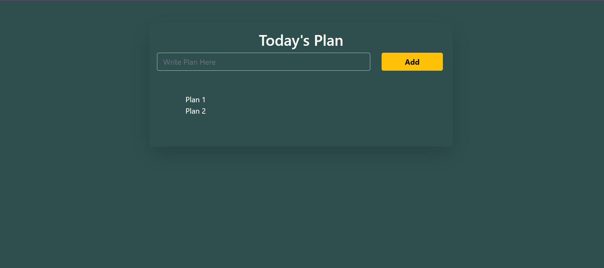

# React Todo App Tutorial
    npx create-react-app reactplan

## install Bootstrap
    npm i bootstrap
    
## create a react component for Plan and main App
> Plan Component 

    function Plan(props){
      return <>
      {console.log("Plan")}
      <li>Plan 1</li>
      </>
    }

> App component

    class App extends Component {
      render() {
      return (
        

          

            

              <h2 className='text-center'>
                Today's Plan
              </h2>
              

                

                  <input type="text" className='form-control' name="" id="" placeholder='Write Plan Here'/>
                

                

                  <button className="btn btn-warning px-5 fw-bold">Add</button>
                

                

                  <ul className="list-unstyled row m-5">
                  <Plan/>
                  </ul>
                

              

            

          

        

      )
      }
    }

## After this much work

> 

## Making the add button WORK!!

> we will use state property of the App component

    class App extends Component {
        state={
            items:[],
            text:"",
        }

> put the value of input field to **this.state.text**

    <input type="text" className='form-control' name="" id="" placeholder='Write Plan Here' value={this.state.text}/>
    
> Now you wont be able to change in input field..
> 
> To change it use *onChange* event handler

    <input type="text" className='form-control' name="" id="" placeholder='Write Plan Here'
						  value={this.state.text} onChange={this.handleChange}/>
                          
  handleChange event handler sets the value of text property of state to the input text
  
      handleChange=e=>{
            this.setState({text:e.target.value})
        }
        
> Now lets add the input to the items array inside state property
>> Make onclick event handler on the add button

    

        <button className="btn btn-warning px-5 fw-bold" onClick={this.handleAdd}>Add</button>
    

    
>> handleAdd event handler updates and adds input text inside items array of state property

	handleAdd=e=>{
		if(this.state.text!==""){
			const items=[...this.state.items,this.state.text]
			this.setState({
				items:items,
				text:"",
			})
		}
	}
>> Now send this items array to **Plan** component and get it *listified*

     <ul className="list-unstyled row m-5">
        {
            this.state.items.map((value,i)=>{
                return <Plan value={value}/>
            })
        }
	</ul>
    
>> Have Plan component accept the parameters

    function Plan(props){
        return <>
        <li>{props.value}</li>
        </>
    }
